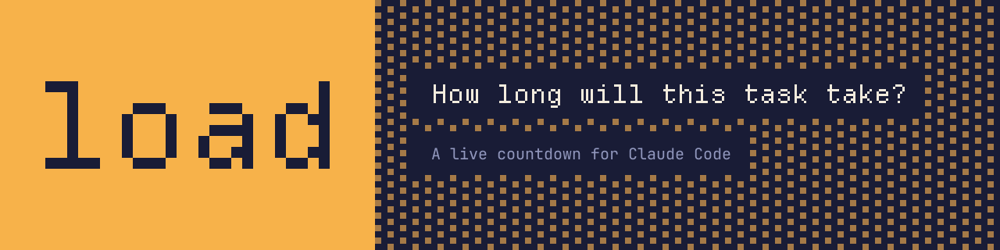
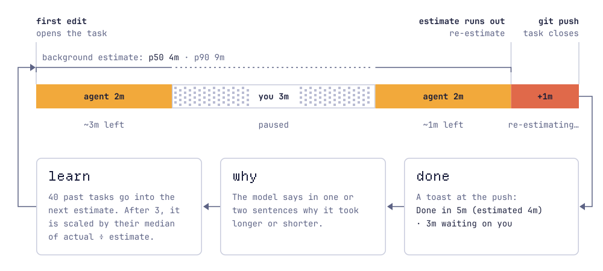

<p align="center">
  
</p>

**load** adds a live time-remaining countdown to Claude Code. Agent UIs tell you *working*, *done* or *needs input*. load tells you *how long*.

<p align="center">
  
</p>

## Install

In a Claude Code session:

```
/plugin install load --marketplace awlevin/claude-load
```

Answer `y` to add the marketplace. The plugin is named `load` because plugin names cannot start with `claude-`.

## How it works

<picture>
  <source media="(prefers-color-scheme: dark)" srcset="assets/how-it-works-dark.svg">
  
</picture>

- **Open.** The first edit, or a shell command that changes the git working tree, opens a task. The start moves back to the start of that turn, or to the spawn of the background agent that made the change.
- **Estimate.** A background `$.model.fork` gives a median (p50) and a 90th-percentile (p90) estimate. It reuses the session's prompt cache, so the agent never waits. The prompt includes up to 40 past tasks from the same repo, with their real times.
- **Two clocks.** Agent time and your waiting time are separate. The countdown pauses only when nothing is working.
- **Overrun.** When the estimate runs out, the status line shows `re-estimating…`, up to 3 times. It never goes negative.
- **Close.** A successful `git push` or `gh pr create` closes the task. The model then writes 1–2 sentences on why the task took longer or shorter than estimated.
- **Calibrate.** After 3 finished tasks in a repo, estimates are scaled by that repo's median ratio of actual to estimated time.

Plugins cannot draw in Claude Code's multi-agent session list, so the countdown lives in each session's spinner and status line.

## Commands

| Command | What it does |
| --- | --- |
| `/load` | Shows the open task and the accuracy of past estimates in this repo |
| `/load stats` | Opens a pane with accuracy (overall and by repo) and finished tasks, with their explanations |
| `/load done` | Closes the open task, for work that does not end with a push |
| `/load drop` | Drops the open task, so it does not count |

## Settings

In `/config`, search for "load":

- `barStyle`: `blocks` (default) `█████░░░`, `parallelograms` `▰▰▰▰▰▱▱▱`, or `ascii` `[#####---]`.
- `onOverrun`: `re-estimate` (default), or `say-overdue` to show *taking longer than expected*.

## Is it worth it?

`/load stats` compares the estimates with a baseline: a guess of the repo's median task time. If the estimates do not beat the baseline in your repo, the plugin does not help there.

## Data and privacy

Each task is one JSON file in `~/.claude/load/tasks/<repo>/`. Set `CLAUDE_LOAD_DIR` to move it. A record holds a short summary, the times, the estimates and the explanation. It holds no transcript. The repo key is the normalized remote (`github.com/owner/repo`) and the record keeps the PR URL, so you can share records with your team.

## Develop

```sh
claude --plugin-dir .      # load from this folder, with hot reload
claude plugin validate .
claude plugin test .
```

The logic is in `hooks/core.ts`, as pure functions tested in `tests/core.test.ts`. The wiring is in `hooks/register.tsx`. The images are built from code in `assets/src` (`npm install && npm run build`).

Built on the function-hooks API of Claude Code 2.1.293 (early access).
